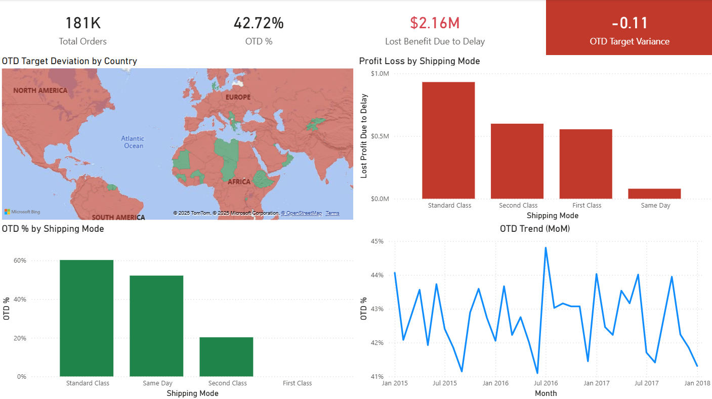

# 📊 Supply Chain Performance Analysis: On-Time Delivery (OTD) and Financial Impact

This project is a comprehensive end-to-end data analysis and business intelligence solution developed to assess the health of a global supply chain, quantify profit leakage due to delays, and identify operational failure points.

The solution utilizes Power BI for advanced data modeling, DAX time intelligence, and conditional visualization.

## 🔗 About the Data (180k Rows, 52 Columns)

This project is based on the **[DataCo SMART SUPPLY CHAIN FOR BIG DATA ANALYSIS](https://www.kaggle.com/datasets/shashwatwork/dataco-smart-supply-chain-for-big-data-analysis)** dataset sourced from Kaggle. This dataset provides a rich, realistic simulation of a modern global supply chain used by the fictitious company, DataCo Global. The data comprises roughly 180,000 transactions recorded over three years, detailing order, shipping, and delivery processes across multiple countries.

## 🛠️ Technical Stack and Features

| **Category** | **Component** | **Description** |
| :--- | :--- | :--- |
| **Tool** | Power BI & Excel | Primary visualization and modeling environment. |
| **Data Source** | Global Order Transactional Data (90MB) | Raw data covering orders, shipping, and delivery dates. |
| **Data Modeling** | **Star Schema** (Fact/Dim) | Normalized `Fact_Orders` linked to `Dim_Country`, `Dim_Customer`, and `Dim_Date` (all 1:M relationships). |
| **DAX Measures** | **OTD %** | Core KPI calculation for On-Time Delivery. |
| **DAX Measures** | **OTD Target Variance** | Compares OTD % against the business goal defined in a separate `Targets` table. |
| **DAX Measures** | **Lost Benefit Due to Delay** | Conditional sum of lost profit where `Days_of_Delay > 0`. |
| **DAX Measures** | **OTD MoM Change** | Utilizes `DATEADD` for trend analysis. |

## 🚀 Key Deliverables and Business Value

The analysis confirmed a **systemic underperformance** resulting in approximately **$2.16M in lost profit opportunity** over the period. The report provides clear, actionable insights for immediate resource allocation.

* **Identified Critical Failure Point:** Located a specific **0%** **OTD rate** for the "First Class" shipping mode, confirming a complete operational failure in that pipeline (highest priority action item).

* **Quantified Financial Risk:** Calculated **Lost Benefit Due to Delay** to precisely quantify the financial erosion caused by late shipments.

* **Data Modeling Mastery:** Transformed raw transactional data into a normalized **Star Schema** (Fact/Dimension structure), fixing initial Many-to-Many cardinality errors to ensure accurate filtering and analysis.

* **Advanced Analytics:** Implemented **Time Intelligence (Month-over-Month OTD Trend)** and a **Geographic Risk Map** for targeted resource deployment.

## 🎯 Key Visualizations

The final dashboard is designed with a minimalist, high-contrast palette to drive executive focus.

### 1. Geographic Risk Map

* **Function:** Colors countries based on **OTD Target Variance** (Red = Worst Performance, Green = Target Met).

* **Insight:** Enables immediate resource targeting to regions with the highest risk and performance deviation.

### 2. Profit Loss by Shipping Mode

* **Function:** Separated bar chart showing the financial risk for each shipping method.

* **Insight:** Highlights **Standard Class** as the major financial risk (\$930K loss) and identifies the **First Class** failure point (0% OTD).

### 3. OTD Trend (MoM)

* **Function:** Line chart showing the chronological trend of OTD % over the period.

* **Insight:** Confirms the lack of sustained improvement, indicating the need for systemic process change rather than minor fixes.
